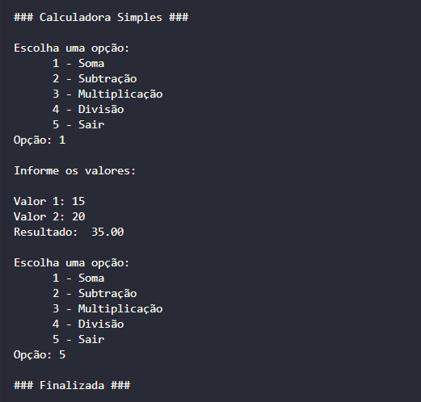
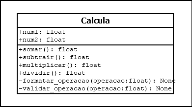

# Calculadora em Python
### Python

## Diagrama de classe

## Objetivo

Desenvolver uma calculadora simples em Python para realizar operações matemáticas básicas.

A aplicação utiliza orientação a objetos, tratamento de exceções e interação via terminal.

Também aplica validações e formatação dos resultados das operações.

## Finalidade

* Realizar operações matemáticas básicas:

  * Soma
  * Subtração
  * Multiplicação
  * Divisão

* Receber valores informados pelo usuário via terminal

* Permitir escolha da operação através de menu interativo

* Utilizar programação orientada a objetos com a classe `Calcula`

* Aplicar tratamento de exceções:

  * Divisão por zero
  * Erros personalizados (`ErroCustomizado`)
  * Entradas inválidas

* Formatar a exibição dos resultados:
 
  * Decimais com duas casas

* Encerrar a aplicação quando o usuário selecionar a opção de saída

* Organizar o projeto em módulos:

  * `model`
  * `exceptions`
  * arquivo principal de execução

## Start Calculadora

- **abrir pasta na linha de comando** : `cd app`

- **executar programa na linha de comando** : `python3 run.py`

## Contatos
- E-mail: [kba.2879@gmail.com](mailTo:kba.2879@gmail.com)
- Linkedin: [/katarine-albuquerque](https://www.linkedin.com/in/katarine-albuquerque/)
